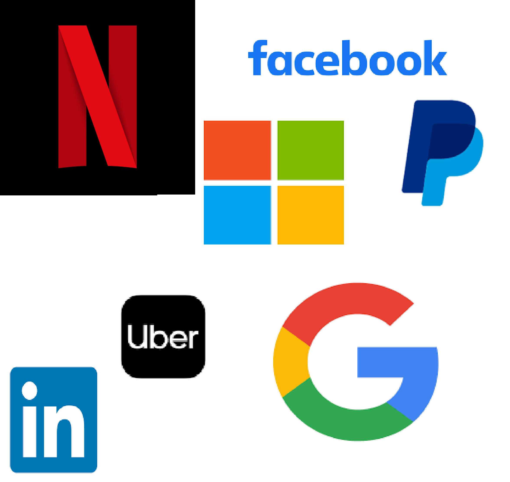

# ***JavaScript and its Use cases in some major oraganizations***

## **What is JavaScript ?**
> ***JavaScript is a dynamic computer programming language. It is lightweight and most commonly used as a part of web pages, whose implementations allow client-side script to interact with the user and make dynamic pages. It is an interpreted programming language with object-oriented capabilities.
JavaScript is a scripting or programming language that allows you to implement complex features on web pages — every time a web page does more than just sit there and display static information for you to look at — displaying timely content updates, interactive maps, animated 2D/3D graphics, scrolling video jukeboxes, etc. — you can bet that JavaScript is probably involved.***

## ***The merits of using JavaScript are***

* **Less Server Interaction** − You can validate user input before sending the page off to the server. This saves server traffic, which means less load on your server.

* **Immediate feedback to the visitors** − They don't have to wait for a page reload to see if they have forgotten to enter something.

* **Increased Interactivity** − You can create interfaces that react when the user hovers over them with a mouse or activates them via the keyboard.

* **Richer Interfaces** − You can use JavaScript to include such items as drag-and-drop components and sliders to give a Rich Interface to your site visitors

## JavaScript frameworks
* A JavaScript framework is a collection of JavaScript code libraries that provide developers with pre-written code for routine programming tasks. Frameworks are structures with a particular context and help you create web applications within that context.

* It is completely possible to build strong web applications without JavaScript frameworks, but frameworks provide a template that handles common programming patterns. Each time you have to build an application, you don’t need to write code for every single feature from scratch. Instead, you can build upon an existing feature set.

* JavaScript frameworks, like most other frameworks, provide some rules and guidelines. Using these rules and guidelines, any developer can make complex applications faster and more efficiently than if they decided to build from scratch. The rules and guidelines help shape and organize your website or web application too

## ***Some of the major Organizations Using JavaScript***

#### Microsoft
* Microsoft works heavily on JavaScript to built its Edge web browser. All browsers need to process and execute JavaScript efficiently, so Microsoft has developed and maintains its own JavaScript engine for Edge.

* Recently, Microsoft has really embraced NodeJS. They thoroughly support Node on the Azure cloud platform. Its one of Azure’s major features, and they’ve integrated Visual Studio support for Node.

* Microsoft has also developed a version of Node for Internet Of Things(IoT) applications. NodeJS is great of IoT because it’s light weight and efficient.

#### Netflix
* Netflix started out using Java for just about everything. They too ran into problems with Java’s size and the time it required to develop.

* Over time, Netflix moved away from its more traditional structure into the cloud and started to introduce NodeJS. With Node, Netflix was able to break down pieces of their user interface into individual services. This more distributed approach was able to speed things up an alleviate stress on their servers. Today, a large portion of Netflix’s interface is running on Node.

#### Uber
* Uber needs to handle loads of data in real time. They have millions of requests coming in continuously, and that’s not just hits on a page. Uber needs to track driver locations, rider locations, and incoming ride requests. It has to seamlessly sort that data and match riders as fast as possible.

* All of that plays to NodeJS’s and JavaScript’s strengths. Node is designed to handle requests and hand off data quickly. It’s asynchronous capabilities are a huge part of that. Node is central to Uber’s user facing stack for just that reason.

#### Facebook
* Facebook has invented its own way of breaking down and delivering sections of JavaScript separately. In an odd way, each section of your Facebook page is a collection of independent JavaScript applications.

* Facebook doesn’t stop there. Facebook created React, one of the most popular front end frameworks. Facebook uses React on Facebook.com as well as Instagram and WhatsApp.

#### Google
* Google Uses JavaScript everywhere. Google’s search results that spring up as your typing get there with JavaScript. The Gmail web client is powered by JavaScript. The Google Docs they also uses JavaScript

* Google develops and usually open sources it’s own JavaScript tools. The most obvious example is AngularJS. Angular is used most prominently in Google’s DoubleClick advertising platform, but it’s also one of the most popular front end frameworks available.

* Google’s more intensive services, like Google Docs, use Closure Tools. This set of tools compiles JavaScript into a lower-level faster form more suited for rich and highly responsive web applications.

* Google developed Chrome. Chrome, being a web browser, needed a JavaScript engine, so Google made V8. V8 not only powers Chrome, it’s at the heart of NodeJS. So, without Google, there would be no Node.

## Conclusion

* These companies are among the largest tech companies in the world. Many are also running the largest production deployments of NodeJS. The others are responsible for important parts of the JavaScript ecosystem as a whole

* So much of the web runs on JavaScript, it’d be much harder to find a company that doesn’t use JavaScript in some way.
